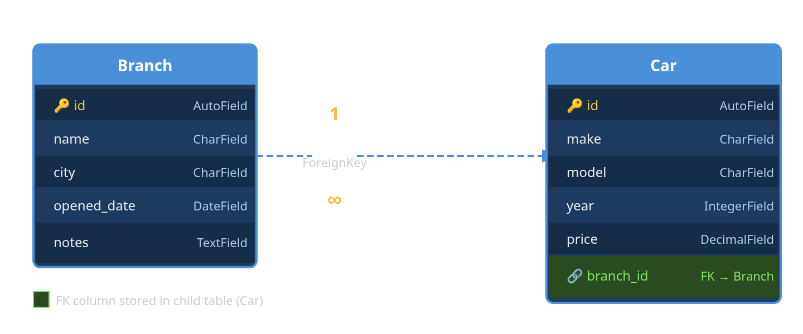
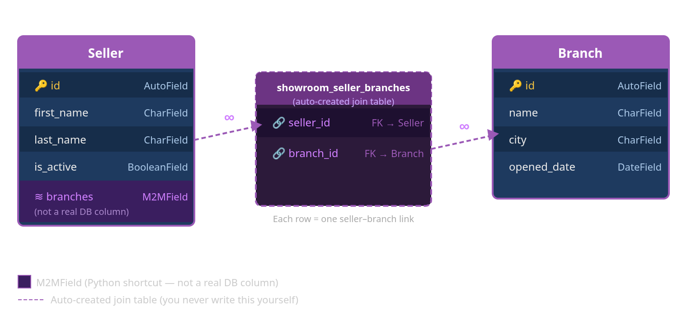
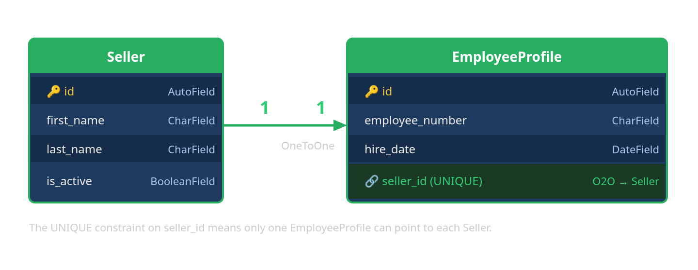
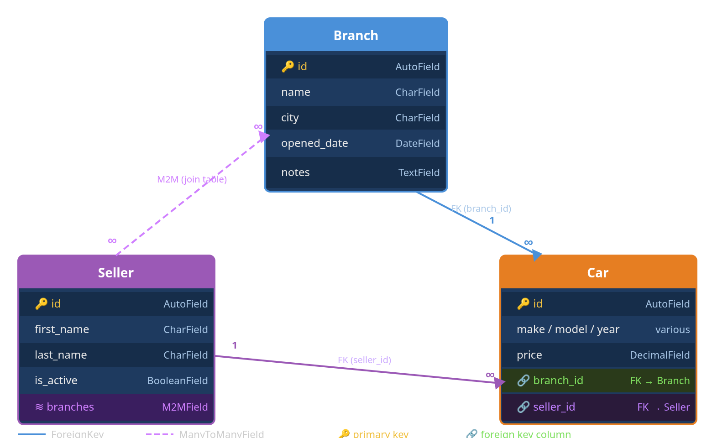
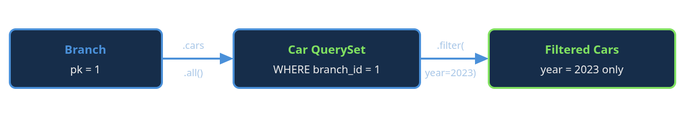
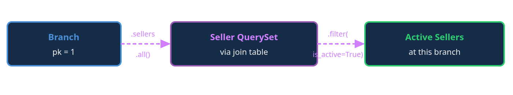
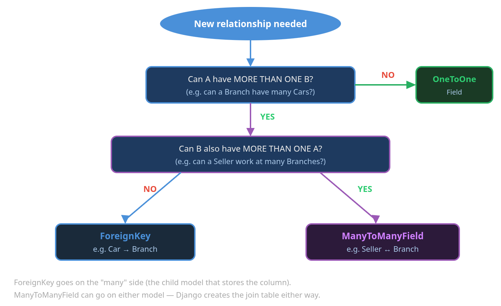

# Django Model Relationships
## A Visual Guide Using a Car Dealership Example

---

## Table of Contents

1. [What is a Model Relationship?](#1-what-is-a-model-relationship)
2. [ForeignKey — Many-to-One](#2-foreignkey--many-to-one)
3. [ManyToManyField — Many-to-Many](#3-manytomanyfield--many-to-many)
4. [OneToOneField — One-to-One](#4-onetoonefield--one-to-one)
5. [Combining Relationships — The Full Picture](#5-combining-relationships--the-full-picture)
6. [How Relationships Become Queries](#6-how-relationships-become-queries)
7. [Choosing the Right Relationship](#7-choosing-the-right-relationship)

---

## 1. What is a Model Relationship?

A **relationship** is a link between two database tables. Django models let you define these links directly in Python — Django handles the underlying SQL for you.

There are three types:

| Type | Django field | Real-world example |
|---|---|---|
| Many-to-One | `ForeignKey` | Many cars belong to one branch |
| Many-to-Many | `ManyToManyField` | Sellers work at multiple branches |
| One-to-One | `OneToOneField` | One seller has one employee profile |

Every example in this guide uses three models from the car dealership tutorial: **Branch**, **Seller**, and **Car**.

---

## 2. ForeignKey — Many-to-One

### The concept

A **ForeignKey** says: *"many of these belong to one of those."*

In our dealership: many **Cars** belong to one **Branch**. Each car stores the ID of its branch in a column called `branch_id`. Django manages that column automatically.




### The Python code

```python
class Branch(models.Model):
    name        = models.CharField(max_length=100)
    city        = models.CharField(max_length=80)
    opened_date = models.DateField()
    notes       = models.TextField(blank=True)

    def __str__(self):
        return f'{self.name} ({self.city})'


class Car(models.Model):
    make   = models.CharField(max_length=60)
    model  = models.CharField(max_length=60)
    year   = models.IntegerField()
    price  = models.DecimalField(max_digits=10, decimal_places=2)

    # ← The ForeignKey
    branch = models.ForeignKey(
        Branch,                    # the model we point TO
        on_delete=models.CASCADE,  # if Branch deleted, delete its Cars too
        related_name='cars',       # gives us branch.cars.all()
    )
```

### What `on_delete` means

| Option | Behaviour when the parent (Branch) is deleted |
|---|---|
| `CASCADE` | Delete all related Cars automatically |
| `SET_NULL` | Set `branch_id` to NULL (field must allow `null=True`) |
| `PROTECT` | Block the delete — raise an error |
| `SET_DEFAULT` | Set `branch_id` to a default value |

### Accessing the relationship in Python

```python
# Forward: from Car to Branch (returns a single object)
car = Car.objects.get(pk=1)
car.branch          # → <Branch: North End (Toronto)>
car.branch.city     # → "Toronto"

# Reverse: from Branch to its Cars (returns a QuerySet)
branch = Branch.objects.get(pk=1)
branch.cars.all()              # all cars at this branch
branch.cars.filter(year=2023)  # only 2023 cars
branch.cars.count()            # number of cars
```

> 💡 The **forward** direction (`car.branch`) always returns a single object.  
> The **reverse** direction (`branch.cars`) always returns a QuerySet — even if only one car exists.

---

## 3. ManyToManyField — Many-to-Many

### The concept

A **ManyToManyField** says: *"many of these can be linked to many of those."*

In our dealership: a **Seller** can work at multiple **Branches**, and each **Branch** has multiple **Sellers**. Neither table stores the other's ID directly — Django creates a **hidden join table** to hold the connections.



</svg>

### The Python code

```python
class Seller(models.Model):
    first_name = models.CharField(max_length=50)
    last_name  = models.CharField(max_length=50)
    is_active  = models.BooleanField(default=True)

    # ← The ManyToManyField
    branches = models.ManyToManyField(
        Branch,
        related_name='sellers',  # gives us branch.sellers.all()
    )
```

> 💡 You only declare `ManyToManyField` **on one side**. Django creates the join table for both directions automatically. It does not matter which model you put it on — the behaviour is symmetrical.

### Accessing the relationship in Python

```python
# Forward: seller → their branches
seller = Seller.objects.get(pk=1)
seller.branches.all()               # all branches this seller works at
seller.branches.filter(city='Toronto')

# Reverse: branch → its sellers (via related_name='sellers')
branch = Branch.objects.get(pk=1)
branch.sellers.all()                # all sellers at this branch
branch.sellers.filter(is_active=True)

# Adding and removing links
seller.branches.add(branch)         # link this seller to a branch
seller.branches.remove(branch)      # unlink
seller.branches.set([b1, b2])       # replace all links at once
seller.branches.clear()             # remove all links for this seller
```

### What the join table looks like in the database

```
showroom_seller_branches
┌───────────┬───────────┐
│ seller_id │ branch_id │
├───────────┼───────────┤
│     1     │     1     │  ← Alice works at North End
│     1     │     2     │  ← Alice works at Lakeshore
│     2     │     1     │  ← Bob works at North End
│     2     │     3     │  ← Bob works at Westgate
│     3     │     2     │  ← Carol works at Lakeshore
│     3     │     3     │  ← Carol works at Westgate
│     3     │     4     │  ← Carol works at Eastview
└───────────┴───────────┘
```

### The `distinct()` gotcha

When you filter on a M2M field, the join can produce duplicate rows:

```python
# If a seller works at TWO Toronto branches, they appear TWICE
Seller.objects.filter(branches__city='Toronto')          # ← duplicates possible

# Fix: always add .distinct() when filtering across a M2M
Seller.objects.filter(branches__city='Toronto').distinct()  # ← correct
```

---

## 4. OneToOneField — One-to-One

### The concept

A **OneToOneField** is a `ForeignKey` with a uniqueness constraint — the child row can only point to **one** parent, and the parent can only be pointed to by **one** child. It is used to *extend* a model with extra fields without changing the original.

In our dealership: each **Seller** might have exactly one **EmployeeProfile** storing HR data like hire date and employee number, kept separate from the core Seller model.




### The Python code

```python
class EmployeeProfile(models.Model):
    employee_number = models.CharField(max_length=20, unique=True)
    hire_date       = models.DateField()

    # ← The OneToOneField
    seller = models.OneToOneField(
        Seller,
        on_delete=models.CASCADE,
        related_name='profile',  # gives us seller.profile
    )
```

### Accessing the relationship in Python

```python
# Forward: profile → seller
profile = EmployeeProfile.objects.get(pk=1)
profile.seller           # → <Seller: Alice Martin>
profile.seller.is_active

# Reverse: seller → profile (returns the object directly — NOT a QuerySet)
seller = Seller.objects.get(pk=1)
seller.profile           # → <EmployeeProfile: EMP001>
seller.profile.hire_date

# If no profile exists, accessing seller.profile raises RelatedObjectDoesNotExist
# Safe pattern:
try:
    profile = seller.profile
except EmployeeProfile.DoesNotExist:
    profile = None
```

> 💡 The key difference from `ForeignKey`: the reverse accessor on a `OneToOneField` returns **a single object**, not a QuerySet. There can only ever be one.

---

## 5. Combining Relationships — The Full Picture

This diagram shows all three models from the dealership tutorial together, with both `ForeignKey` links on Car and the `ManyToManyField` between Seller and Branch.




### Reading the diagram

- **Branch → Car** (solid blue, `1` to `∞`): one Branch has many Cars. `branch_id` lives in the Car table.
- **Seller → Car** (solid purple, `1` to `∞`): one Seller manages many Cars. `seller_id` lives in the Car table.
- **Seller ↔ Branch** (dashed purple, `∞` to `∞`): linked via a hidden join table. Neither table stores the other's ID directly.

---

## 6. How Relationships Become Queries

This section shows the same data-access patterns as flow diagrams, ORM code, and the SQL Django generates underneath.

### Pattern 1 — Get all cars at a branch (reverse ForeignKey)




```python
# ORM
branch = Branch.objects.get(pk=1)
cars_2023 = branch.cars.filter(year=2023)

# SQL Django generates:
# SELECT * FROM showroom_car
# WHERE branch_id = 1 AND year = 2023;
```

### Pattern 2 — Get active sellers at a branch (reverse M2M)



```python
# ORM
branch = Branch.objects.get(pk=1)
active_sellers = branch.sellers.filter(is_active=True)

# SQL Django generates (simplified):
# SELECT showroom_seller.*
# FROM showroom_seller
# INNER JOIN showroom_seller_branches
#   ON showroom_seller.id = showroom_seller_branches.seller_id
# WHERE showroom_seller_branches.branch_id = 1
#   AND showroom_seller.is_active = TRUE;
```

### Pattern 3 — Cross-model lookup with `__` (double underscore)

Django lets you traverse relationships in filter arguments using `__`. This means you can filter a model based on fields in a related model without writing a JOIN yourself.

```python
# All cars at branches in Toronto (one FK hop)
Car.objects.filter(branch__city='Toronto')

# All cars whose seller is active (one FK hop)
Car.objects.filter(seller__is_active=True)

# All sellers who have at least one car over $40,000 (reverse FK hop)
Seller.objects.filter(cars__price__gt=40000).distinct()

# All cars at branches where Alice works (FK + M2M, two hops)
Car.objects.filter(branch__sellers__first_name='Alice').distinct()
```

---

## 7. Choosing the Right Relationship



### Quick reference

```python
# Many Cars belong to ONE Branch → ForeignKey on Car
class Car(models.Model):
    branch = models.ForeignKey(Branch, on_delete=models.CASCADE,
                               related_name='cars')

# A Seller works at MANY Branches, a Branch has MANY Sellers → ManyToManyField
class Seller(models.Model):
    branches = models.ManyToManyField(Branch, related_name='sellers')

# Each Seller has exactly ONE EmployeeProfile → OneToOneField
class EmployeeProfile(models.Model):
    seller = models.OneToOneField(Seller, on_delete=models.CASCADE,
                                  related_name='profile')
```

### Summary table

| Question | Answer | Field |
|---|---|---|
| Does A store B's ID? | One B per A row | `ForeignKey` (on A) |
| Do both sides link to many of each other? | Use a join table | `ManyToManyField` |
| Is there always exactly one on each side? | One A per B, one B per A | `OneToOneField` |
| What happens to children when parent is deleted? | Depends on `on_delete=` | `CASCADE`, `SET_NULL`, `PROTECT` |
| Can I filter across relationships? | Yes — use `__` double underscore | `filter(branch__city='Toronto')` |
| Do M2M filters produce duplicates? | Yes — always add `.distinct()` | `.filter(...).distinct()` |
